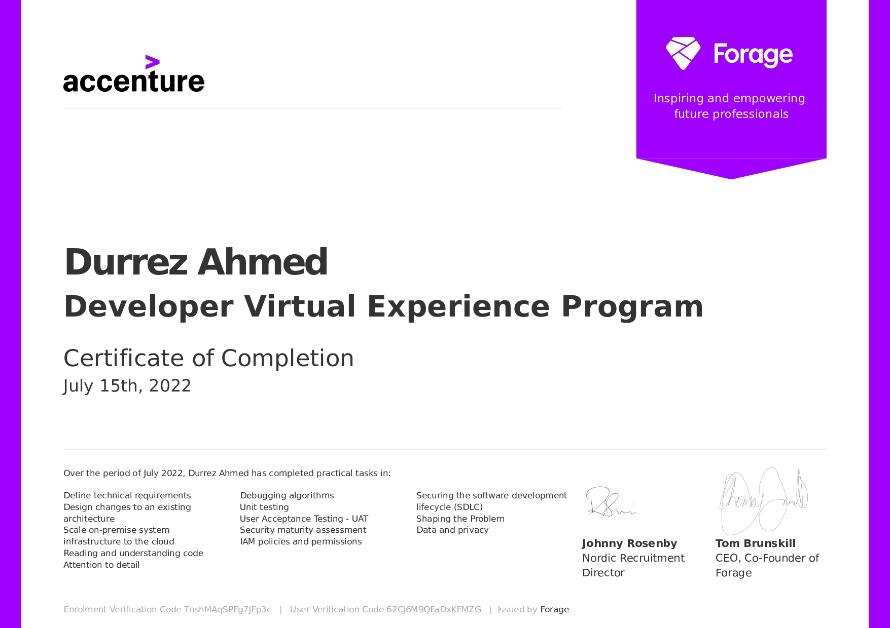

# Accenture Nordics Developer Virtual Internship

This repository contains the submitted files of the various tasks assigned by Accenture Nordics Developer Virtual Internship.

## Overview:

#### 1. <ins>Architecture:</ins>

- Define technical requirements (Understanding priorities and formulating measurable requirements)

- Design changes to an existing architecture (Evaluating design decisions)

- Scale on-premise system infrastructure to the cloud (Evaluating options to run software)

#### 2. <ins>Programming:</ins>

- Reading and understanding code (Reading code can be less exciting than running it, but sometimes it is the necessary thing to do)

- Attention to detail (Not all code that looks similar does the same thing)

- Debugging algorithms (Read and debug some of the client’s code)

#### 3. <ins>Testing:</ins>

- Unit testing (Solve problems and implement tests for small code units)

- User Acceptance Testing - UAT (Explore User Acceptance Testing)

#### 4. <ins>Security:</ins>

- Security maturity assessment (Conducting a security maturity assessment for a new client)

- IAM policies and permissions (In this task, you will implement the right access policies for different kinds of data)

- Securing the software development lifecycle (SDLC) (In this task, your knowledge will be tested within the area of application security in the context of SDLC)

#### 5. <ins>Artificial Intelligence:</ins>

- Shaping the Problem (Interpret what functionality the salesperson and client are really asking for)

- Data and privacy (Point out what data are considered sensitive personal data and advise the client on how to proceed with the planned machine learning algorithm)

## My Certificate of Completion

